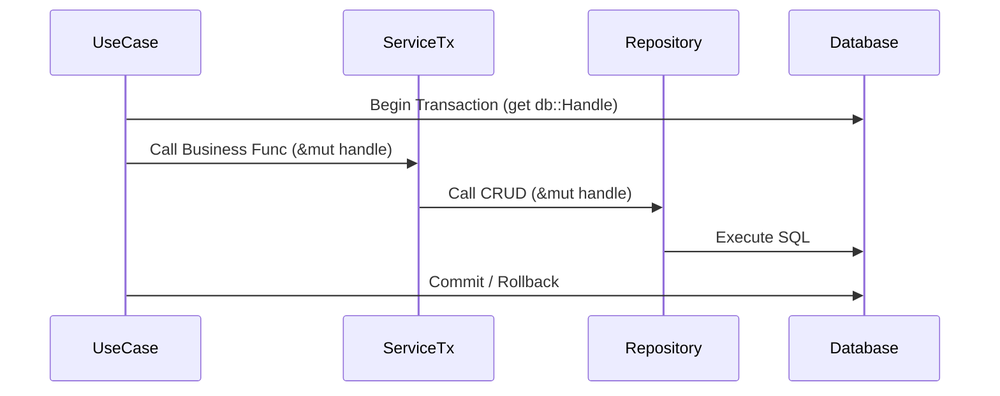

# Application Architecture

본 문서는 Shinespark 프로젝트의 계층형 아키텍처와 트랜잭션 처리(Unit of Work) 전략을 정의합니다.

## 1. 계층별 역할 (Layer Responsibilities)

### 1.1. UseCase Layer
- **역할**: 애플리케이션의 핵심 비즈니스 로직을 보유하며, 사용자 요청에 대한 전체적인 흐름을 제어(Orchestration)합니다.
- **특징**:
  - 여러 Service 및 Repository를 조합하여 하나의 완결된 비즈니스 시나리오를 완성합니다.
  - **트랜잭션 경계**: `db::Handle`을 생성하고 관리하며, 작업 성공 시 Commit, 실패 시 Rollback을 수행합니다.
  - 도메인 전반에 걸친 복잡한 규칙은 UseCase에서 처리합니다.

### 1.2. Service Layer (Trait Separation)
인터페이스와 구현이 분리된 레이어로, 작업의 성격에 따라 두 개의 Trait으로 나뉩니다.

- **Service (Read/Stateless)**:
  - `sqlx::Pool`을 내부에 멤버로 가지며 사용합니다.
  - 단순 조회(Read)나 트랜잭션이 필요 없는 단순 유틸리티성 기능을 제공합니다.
- **ServiceTx (Transactional/Atomic)**:
  - 모든 메서드는 파라미터로 `db::Handle`을 받습니다.
  - 원자적(Atomic)으로 수행되어야 하는 도메인 연산을 담당하며, UseCase가 관리하는 트랜잭션의 일부로 실행됩니다.

> [!NOTE]
> 실무적인 구현 편의를 위해 하나의 구현체(예: `UserServiceImpl`)가 `UserService`와 `UserServiceTx` Trait을 모두 구현할 수 있습니다.

### 1.3. Repository Layer
- **역할**: 데이터베이스 테이블에 직접 접근하여 CRUD(Create, Read, Update, Delete)를 수행합니다.
- **규칙**:
  - 모든 저장소 메서드는 `db::Handle`을 파라미터로 받아야 합니다.
  - 이를 통해 상위 레이어(UseCase)에서 시작된 트랜잭션에 참여(UOW 지원)할 수 있습니다.

---

## 2. 트랜잭션 흐름 (Transaction Flow)

UseCase에서 시작된 트랜잭션이 하위 레이어로 전달되는 과정은 다음과 같습니다.

---

## 3. 요약 (UOW Pattern)

| 레이어 | 데이터 연결 객체 | 주요 역할 |
| :--- | :--- | :--- |
| **UseCase** | `db::Handle` 생성/관리 | 비즈니스 로직, 트랜잭션 제어 (UOW 중심) |
| **Service** | `sqlx::Pool` 소유 | 단순 조회, 단독 편의 기능 |
| **ServiceTx** | `db::Handle` 주입 | 트랜잭션 내부의 원자적 도메인 로직 |
| **Repository** | `db::Handle` 주입 | 순수 데이터 접근 (CRUD) |